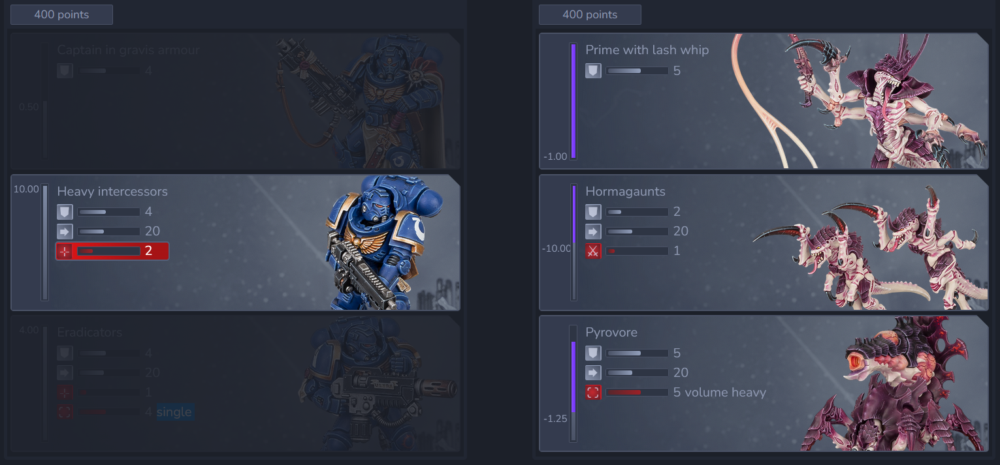

### A custom minimalistic, digital, interactive ruleset for the Warhammer 40.000 tabletop board game.
Run "md_create_documents.py" with Python 3.11 or higher to generate HTML documents, then open "index.html".
(all other data under "resources" must be present to work properly)

## Faction list construction example

## Match data example 1

## Match data example 2

All original images ©Games Workshop.

